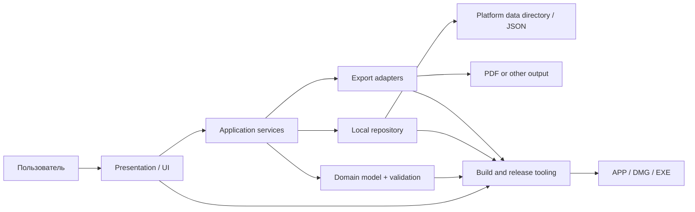

# Базовая архитектура локального desktop-приложения

## 1. Назначение документа

Этот документ обобщает архитектуру CV Builder в reusable-шаблон для небольших
и средних локальных desktop-приложений на Python. Он подходит для продуктов,
которые:

- работают на macOS и Windows;
- используют формы, локальную библиотеку документов и экспорт;
- не требуют backend или учетной записи;
- должны собираться в DMG и Windows Setup EXE;
- развиваются кодинг-агентом совместно с владельцем продукта.

Архитектура сохраняет простоту текущего приложения, но разделяет UI, данные,
хранилище, экспорт и packaging так, чтобы следующий проект не вырос в один
неуправляемый файл.

## 2. Архитектурные принципы

1. **Local-first:** пользовательские данные принадлежат пользователю и по
   умолчанию не покидают устройство.
2. **Offline by default:** основные сценарии не зависят от сети.
3. **Portable data:** основной формат должен быть читаемым и экспортируемым.
4. **Atomic persistence:** запись через временный файл и `replace`, чтобы сбой
   не повреждал документ.
5. **Layered boundaries:** UI не должен знать детали файловой системы и PDF.
6. **One source of truth:** форма отражает один нормализованный domain document.
7. **Deterministic packaging:** иконки, версии и установщики создаются скриптами.
8. **Real-artifact verification:** проверять `.app`, DMG и EXE, а не только
   исходники.
9. **Progressive complexity:** не добавлять базу данных, DI-фреймворк или
   backend до появления реальной необходимости.
10. **Cross-platform from day one:** пути, цвета, шрифты и shortcuts должны
    проектироваться для macOS и Windows.

## 3. Высокоуровневая схема



### Слои

| Слой | Ответственность | Текущий пример |
|---|---|---|
| Presentation | окна, навигация, формы, feedback | `app.py`, CustomTkinter |
| Application | use cases, autosave, import/export orchestration | методы `CVBuilderApp` |
| Domain | schema, defaults, normalization, validation | `cv_model.py` |
| Infrastructure | локальная библиотека и platform paths | `cv_library.py` |
| Output adapters | PDF/CSV/другие форматы | `pdf_generator.py` |
| Packaging | иконки, metadata, installers, signing | `CVBuilder.spec`, scripts |
| Quality | unit, smoke и screenshot checks | `tests/`, `tools/` |

## 4. Рекомендуемая структура будущего проекта

Для небольшого прототипа допустимы четыре текущих Python-файла. После появления
третьего сложного экрана или нескольких use cases рекомендуется структура:

```text
desktop_app/
├── src/
│   └── product_name/
│       ├── main.py
│       ├── domain/
│       │   ├── models.py
│       │   ├── schema.py
│       │   └── validation.py
│       ├── application/
│       │   ├── services.py
│       │   └── commands.py
│       ├── infrastructure/
│       │   ├── repository.py
│       │   ├── paths.py
│       │   └── migrations.py
│       ├── exporters/
│       │   └── pdf.py
│       └── ui/
│           ├── app.py
│           ├── screens/
│           ├── components/
│           ├── theme.py
│           └── state.py
├── assets/
│   ├── AppIcon.iconset/
│   ├── AppIcon.icns
│   └── AppIcon.ico
├── packaging/
│   ├── windows-installer.iss
│   └── windows-version-info.txt
├── tools/
│   ├── build_icon_assets.py
│   ├── capture_ui_screens.py
│   └── smoke_ui.py
├── tests/
├── .github/workflows/
├── pyproject.toml
├── requirements.txt
├── requirements-build.txt
├── build_macos.sh
└── build_windows.ps1
```

### Когда разделять текущий `app.py`

Разделить его, когда выполняется хотя бы одно условие:

- файл превышает примерно 800–1000 строк;
- UI-класс содержит persistence и export logic;
- экран можно тестировать только через запуск всего приложения;
- добавляется второй тип документа;
- появляется несколько окон или независимых workflows.

Следующий шаг для CV Builder — вынести screens/components и application
services, оставив root-классу только composition, navigation и lifecycle.

## 5. Domain model и данные

### Базовый контракт

Определить один нормализованный dictionary/dataclass:

```text
Document
├── scalar fields
├── nested sections
└── repeatable entries[]
```

Для каждого документа иметь:

- `new_document()` — пустой объект без placeholder-данных;
- `example_document()` — отдельный редактируемый пример;
- `normalize_document()` — заполнение optional keys и удаление неизвестных;
- `load_document()` и `save_document()` — UTF-8 и atomic write;
- `schema_version` — рекомендуется добавить в будущих приложениях.

Placeholder обязан быть UI-состоянием, а не значением domain model.

### Миграции

При изменении схемы:

1. прочитать `schema_version`;
2. последовательно применить migrations;
3. нормализовать результат;
4. сохранить только после успешной миграции;
5. оставить portable export совместимым или явно версионировать формат.

### Хранилище

Использовать platform-native application data directory:

- macOS: `~/Library/Application Support/<App>/`;
- Windows: `%APPDATA%\<App>\`;
- Linux: `$XDG_DATA_HOME/<app>/`.

Repository должен предоставлять use cases, а не пути:

```text
list / create / load / save / rename / delete / import
```

Индекс библиотеки хранит metadata, документы — отдельные JSON-файлы. Это
упрощает backup, восстановление и ручную диагностику.

## 6. Application layer

Application service координирует:

- создание и открытие документа;
- переход между документами;
- autosave;
- import/export;
- подтверждение destructive actions;
- обновление progress/status;
- graceful shutdown.

Рекомендуемый state:

```text
current_document_id
current_document
current_screen
dirty
save_status
pending_autosave_job
```

Autosave выполнять с debounce 500–1000 мс. При смене документа, возврате в
library и закрытии приложения вызывать immediate save.

UI не должен напрямую писать JSON или создавать PDF. Он вызывает service и
отображает результат.

## 7. UI-архитектура

### Стек

- Python 3.12;
- Tk/Tkinter 8.6+; рекомендуется Tk 9.0;
- CustomTkinter 5.2+;
- системные file dialogs и message boxes.

Tk создает native window/event loop. Tkinter является Python bridge, а
CustomTkinter предоставляет стилизованные widgets. В готовой PyInstaller
сборке runtime Tk должен быть bundled; конечный пользователь его не ставит.

### Composition

```text
Root window
├── Library screen
└── Editor screen
    ├── Header
    ├── Sidebar/navigation
    └── Content host
        ├── Screen A
        ├── Screen B
        └── Inline editor
```

Переключать постоянные screens через `tkraise`, а не пересоздавать root window.
Повторяемые cards можно пересоздавать из state.

### UI state rules

- placeholder не попадает в collected data;
- одна primary action на экран;
- status сообщает `Saving`, `Saved`, `Failed`, `Exported`;
- destructive action требует подтверждения;
- scrollbar показывается только при необходимости;
- длинный editor имеет фиксированные Save/Cancel actions;
- размеры и цвета задаются design tokens;
- UI проверяется реальными screenshots, а не только HTML-макетом.

### Accessibility и internationalization

Для будущих приложений заранее определить:

- keyboard navigation и focus order;
- контраст и minimum control size;
- масштабирование шрифтов;
- язык интерфейса и формат дат;
- screen-reader ограничения выбранного toolkit.

Строки UI желательно вынести из widgets до добавления второго языка.

## 8. Export adapters

Каждый exporter получает нормализованный domain document и output path:

```python
export(document, destination)
```

Exporter не читает widgets и не изменяет repository.

Для PDF:

- экранировать пользовательский markup;
- разрешать bundled и system font fallback;
- учитывать `_MEIPASS` в PyInstaller;
- тестировать multi-page output и Unicode;
- проверять magic bytes и минимальный размер файла.

ReportLab подходит для детерминированного документного PDF. Для visual-preview
или HTML-like layout можно рассмотреть web renderer, но только после оценки
размера bundle и platform consistency.

## 9. Стек и зависимости

| Задача | Инструмент |
|---|---|
| Runtime | Python 3.12 |
| GUI | Tk 9.0 / Tkinter / CustomTkinter |
| PDF | ReportLab |
| Image processing | Pillow |
| Data | JSON + pathlib |
| Unit tests | pytest |
| UI smoke | Tk automation + диагностический JSON |
| Screenshot QA | platform window capture |
| macOS bundle | PyInstaller + spec |
| macOS installer | codesign + hdiutil |
| macOS trust | Developer ID + notarytool + stapler |
| Windows bundle | PyInstaller |
| Windows installer | Inno Setup 6 |
| Windows trust | SignTool + PFX certificate |
| CI | GitHub Actions |

### Runtime vs build dependencies

`requirements.txt` содержит только то, что нужно приложению. Отдельный
`requirements-build.txt` включает PyInstaller, pytest, Pillow и packaging
utilities. Конечному пользователю Python и зависимости не нужны.

## 10. Обязательные build utilities

1. **Icon builder:** source PNG → optical PNGs, iconset, ICNS и ICO.
2. **Unit tests:** domain, repository, migrations и exporters.
3. **UI smoke:** открыть root, пройти основные screens, закрыть без ввода.
4. **Screenshot capture:** сохранить реальные implementation screens.
5. **Bundle smoke:** запустить frozen app с временным repository.
6. **Metadata verifier:** проверить version, architecture, icon и hashes.
7. **Release workflow:** собрать arm64 macOS, Intel macOS и Windows x64.

Утилиты должны завершаться non-zero exit code при ошибке и не полагаться на
ручную проверку логов.

## 11. Сборка macOS

### Требования разработчика

- Python 3.12 с Tk 8.6+;
- PyInstaller;
- Xcode Command Line Tools;
- `codesign`, `hdiutil`;
- для публичной раздачи: Apple Developer Program.

### Pipeline

```text
tests
→ clean PyInstaller build
→ .app
→ codesign
→ signature verification
→ DMG
→ notarization
→ staple
→ mount and inspect
→ checksum
```

Локальный bundle наследует архитектуру Python/машины. Для arm64 и Intel нужны
отдельные runners или universal2 strategy.

Не использовать системный Apple Python/Tk 8.5: он может создать приложение с
пустым окном на современной macOS.

## 12. Сборка Windows

### Требования разработчика

- Windows 10/11 x64;
- Python 3.12 x64;
- PyInstaller;
- Inno Setup 6;
- Windows SDK только для подписи.

### Pipeline

```text
tests
→ generate multi-size ICO
→ PyInstaller one-dir EXE
→ apply version resources
→ optional SignTool on EXE
→ Inno Setup
→ optional SignTool on installer
→ install/uninstall smoke
→ checksum
```

Иконку подключать и к EXE, и к Setup. Версию синхронизировать между macOS spec,
Windows version info и Inno Setup.

## 13. CI/CD

Workflow должен:

- находиться в `.github/workflows/` в корне repository;
- иметь manual `workflow_dispatch`;
- собираться по release tags;
- использовать explicit read-only permissions;
- запускать tests до packaging;
- завершаться ошибкой, если artifact отсутствует;
- сохранять platform-specific filenames;
- получать сертификаты только через encrypted secrets.

Рекомендуется добавить единый файл версии и генерировать platform metadata,
чтобы не изменять три файла вручную.

## 14. Вопросы, которые кодинг-агент должен задать

### Блокирующие до реализации

1. Какую одну задачу решает приложение и для кого?
2. Какие target OS и architectures обязательны?
3. Приложение распространяется публично или только внутри команды?
4. Нужны ли code signing и notarization?
5. Где должны храниться пользовательские данные?
6. Можно ли отправлять данные в сеть?
7. Какой portable import/export contract обязателен?
8. Какие действия destructive и как они восстанавливаются?
9. Какие форматы output являются частью продукта?
10. Есть ли утвержденные screenshots/design spec/brand assets?

### До проектирования UI

1. Какие основные screens и переходы?
2. Что является primary action на каждом screen?
3. Какие поля обязательны?
4. Нужны ли multiple documents и library?
5. Как работает autosave и что видит пользователь при ошибке?
6. Какие empty/loading/error states нужны?
7. Нужны ли keyboard shortcuts, accessibility и localization?
8. Как приложение ведет себя при маленьком окне?

### До packaging

1. Какие версии и build numbers выпускаются?
2. Нужны ли Apple Silicon, Intel и Windows x64 одновременно?
3. Какие bundle identifier, publisher и installer identity?
4. Подготовлены ли ICNS/ICO и optical sizes?
5. Где находятся сертификаты и кто управляет secrets?
6. Что именно будет передаваться пользователю?
7. Как проверяется clean-machine install?

### Не блокирующие — можно принять default

- точный оттенок secondary surface;
- minor animation timing;
- необязательные shortcuts;
- имя временной build directory;
- retention CI-artifacts.

Агент должен задавать вопрос только тогда, когда ответ меняет архитектуру,
данные, distribution или необратимое действие.

## 15. Выученные уроки

### UI и данные

1. Placeholder нельзя хранить как field value — пользователю приходится его
   удалять, а пример может случайно попасть в PDF.
2. Ручной Save As JSON не заменяет application-managed library.
3. Autosave должен быть фоновым и видимым через status.
4. JSON одновременно полезен как storage, backup и integration contract.
5. Реальная верстка должна сравниваться с design spec по screenshots.
6. Модальный editor разрушает контекст; inline editor лучше для последовательной
   формы.

### Сборка

1. Старый UI в DMG обычно означает stale artifact, неверный source entrypoint
   или неполную clean-сборку.
2. После build нужно проверять содержимое `.app` и DMG, а не timestamp source.
3. Tk 8.5 может дать белое окно; build script обязан проверять Tk version.
4. Локальный macOS build не создает Intel-версию на Apple Silicon автоматически.
5. Ad-hoc signature подходит для локального теста, но не заменяет Developer ID
   и notarization.
6. Windows требует отдельные ICO и version resources.
7. `iconutil` может отклонять корректные PNG; deterministic ICNS writer надежнее.
8. Desktop icon cache требует version/build bump и clean reinstall.
9. `.github/workflows` должен находиться в корне Git repository.
10. Широкое правило `.gitignore` может случайно исключить обязательный spec.

### Иконка

1. Качество 1024 px не гарантирует качество 32 px.
2. Избыточные стеклянные кромки превращаются в blur.
3. Упрощение не должно уничтожать выбранный material style.
4. Optical masters лучше одного универсального downscale.
5. Иконку нужно проверять внутри bundle и installer по hash.

### Работа агента

1. Сначала инспектировать реальные файлы, screenshots и packaging scripts.
2. Отделять diagnosis от implementation.
3. Не заменять выбранный дизайн до визуального подтверждения.
4. Делать reversible versioned assets.
5. После каждой material change запускать пропорциональную проверку.
6. Документировать найденные environment prerequisites.

## 16. Quality gates

### До merge

- unit tests проходят;
- schema normalization покрыта тестами;
- autosave не сохраняет placeholder;
- import/export round trip работает;
- PDF smoke работает;
- UI smoke открывает все основные screens;
- screenshots проверены на target OS;
- required packaging files не исключены `.gitignore`.

### До релиза

- версия синхронизирована;
- arm64, Intel и Windows artifacts собраны;
- иконки и metadata проверены внутри packages;
- signatures валидны;
- macOS notarization/staple успешны;
- install, first launch, save, reopen, export и uninstall проверены;
- checksums опубликованы;
- пользователям передаются только DMG/EXE.

## 17. Definition of Done для будущего приложения

Приложение готово, когда:

1. основной пользовательский workflow завершается без ручной работы с
   внутренними файлами;
2. данные сохраняются атомарно и восстанавливаются после перезапуска;
3. portable export/import документирован;
4. UI соответствует implementation screenshots;
5. tests и smoke checks проходят;
6. installers собираются автоматически для целевых платформ;
7. runtime dependencies bundled;
8. signing status понятен и честно сообщен;
9. архитектурные решения и ограничения записаны;
10. release artifacts проверены на чистых системах.

## 18. Рекомендуемые следующие улучшения CV Builder

1. Вынести версию в единый source и генерировать platform metadata.
2. Разделить `CVBuilderApp` на screens, components и application service.
3. Добавить `schema_version` и migrations.
4. Добавить Windows UI smoke в GitHub Actions.
5. Автоматизировать GitHub Release после подписанной tag-сборки.
6. Добавить localization layer до перевода интерфейса.
7. Добавить backup/restore всей library одним архивом.

