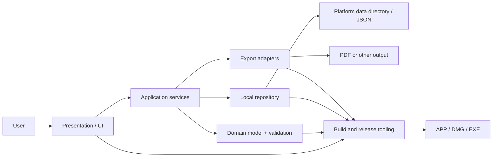

# Base architecture for a local desktop application

## 1. Purpose of this document

This document generalizes the CV Builder architecture into a reusable template
for small and medium local desktop applications in Python. It fits products
that:

- run on macOS and Windows;
- use forms, a local document library, and export;
- do not require a backend or an account;
- must be packaged as a DMG and a Windows Setup EXE;
- are evolved by a coding agent together with the product owner.

The architecture keeps the current app's simplicity but separates UI, data,
storage, export, and packaging so the next project doesn't grow into a single
unmanageable file.

## 2. Architectural principles

1. **Local-first:** user data belongs to the user and does not leave the
   device by default.
2. **Offline by default:** core scenarios do not depend on the network.
3. **Portable data:** the primary format must be readable and exportable.
4. **Atomic persistence:** write via a temp file and `replace`, so a failure
   does not corrupt the document.
5. **Layered boundaries:** the UI must not know the details of the filesystem
   or PDF generation.
6. **One source of truth:** the form reflects a single normalized domain
   document.
7. **Deterministic packaging:** icons, versions, and installers are produced
   by scripts.
8. **Real-artifact verification:** verify the `.app`, DMG, and EXE, not just
   the source.
9. **Progressive complexity:** don't add a database, a DI framework, or a
   backend before there's a real need.
10. **Cross-platform from day one:** paths, colors, fonts, and shortcuts must
    be designed for macOS and Windows.

## 3. High-level diagram



### Layers

| Layer | Responsibility | Current example |
|---|---|---|
| Presentation | windows, navigation, forms, feedback | `ui/app.py`, `ui/screens/`, `ui/components/`, `ui/theme.py` |
| Application | use cases, autosave, import/export orchestration | `application/document_service.py` |
| Domain | schema, defaults, normalization, themes, completion | `domain/` |
| Infrastructure | local library and platform paths | `infrastructure/library.py` |
| Output adapters | PDF and preview rendering | `exporters/` |
| Packaging | icons, metadata, installers, signing | `CVBuilder.spec`, scripts |
| Quality | unit, smoke, and screenshot checks | `tests/`, `tools/` |

### One description, several renderers

Whenever a document is rendered in more than one place (export + on-screen
preview), the *description* of the document must live outside both renderers:

- `domain/themes.py` — colour themes and the contrast rule that picks light or
  dark text for a coloured plate;
- `exporters/page_style.py` — page geometry and typography;
- `exporters/story.py` — the ordered paragraphs, gaps and keep-together groups;
- `exporters/pdf.py` — turns the story into ReportLab flowables;
- `exporters/preview_layout.py` — paginates the same story into canvas lines using the
  PDF font metrics, so the preview breaks lines and pages exactly like the
  export.

A regression test asserts that the preview and the exported PDF agree on the
page count; without it the two renderers drift apart silently.

## 4. Package structure

CV Builder now uses this layout; it is the recommended starting point for a
future app once it grows past a two-file prototype:

```text
desktop_app/
├── src/
│   └── product_name/
│       ├── main.py
│       ├── domain/
│       │   ├── model.py         (schema, defaults, normalization)
│       │   ├── themes.py        (document colour themes)
│       │   ├── text.py
│       │   └── completion.py
│       ├── application/
│       │   └── document_service.py
│       ├── infrastructure/
│       │   └── library.py       (repository + platform paths)
│       ├── exporters/
│       │   ├── page_style.py
│       │   ├── story.py
│       │   ├── pdf.py
│       │   └── preview_layout.py
│       ├── diagnostics.py
│       └── ui/
│           ├── app.py
│           ├── screens/         (library, editor, sections/)
│           ├── components/      (fields, scrollable, preview_canvas)
│           ├── theme.py
│           └── placeholders.py
├── assets/
│   ├── AppIcon.iconset/
│   ├── AppIcon.icns
│   └── AppIcon.ico
├── packaging/
│   ├── windows-installer.iss
│   └── windows-version-info.txt
├── tools/
│   ├── build_icon_assets.py
│   ├── capture_ui_screens.py
│   └── smoke_ui.py
├── tests/
├── conftest.py            (puts src/ on sys.path — no install step)
├── .github/workflows/
├── requirements.txt
├── requirements-build.txt
├── build_macos.sh
└── build_windows.ps1
```

### When to split the root UI file

Split it when at least one of these conditions holds:

- the file exceeds roughly 800-1000 lines;
- the UI class contains persistence and export logic;
- a screen can only be tested by launching the whole application;
- a second document type is being added;
- several windows or independent workflows appear.

CV Builder crossed that line at ~1970 lines and was split (2026-08-01):

- each screen is a `CTkFrame` subclass in `ui/screens/`, each editor section a
  `Section` subclass in `ui/screens/sections/`, both created with a
  `controller` (the root app) they call back into;
- shared widgets and the colour/font tokens live in `ui/components/` and
  `ui/theme.py`, so no screen hard-codes a colour;
- every filesystem or export call goes through `application/document_service.py`;
- the root class keeps only the open document, navigation and the commands the
  screens trigger.

Entry point: `src/cv_builder/main.py` (also `python -m cv_builder`), which
still serves `--smoke-test` and `--ui-smoke-test` inside the frozen app.
`--smoke-test <path> --locale <code>` additionally asserts that the bundled
font for that language really shipped: font lookup falls back to the Latin face
when the file is absent, so without this check a build missing its fonts still
exports a PDF — blank where the CJK text should be, and only on machines
without a matching system font.

## 5. Domain model and data

### Base contract

Define a single normalized dictionary/dataclass:

```text
Document
├── scalar fields
├── nested sections
└── repeatable entries[]
```

Each document should have:

- `new_document()` — an empty object with no placeholder data;
- `example_document()` — a separate editable sample;
- `normalize_document()` — fills in optional keys and drops unknown ones;
- `load_document()` and `save_document()` — UTF-8 and atomic write;
- `schema_version` — recommended to add in future applications.

Placeholders must be UI state, not a value in the domain model.

Presentation choices that belong to the document itself (CV Builder stores the
sidebar colour as a top-level `theme` key) live in the document JSON, not in
the library index: an exported file must render the same way after import.
Such keys stay optional — `normalize_document()` falls back to the default for
older documents and rejects unknown values, so no migration is required.

### Migrations

When the schema changes:

1. read `schema_version`;
2. apply migrations sequentially;
3. normalize the result;
4. save only after a successful migration;
5. keep portable export compatible or explicitly version the format.

### Storage

Use the platform-native application data directory:

- macOS: `~/Library/Application Support/<App>/`;
- Windows: `%APPDATA%\<App>\`;
- Linux: `$XDG_DATA_HOME/<app>/`.

The repository should expose use cases, not paths:

```text
list / create / duplicate / load / save / rename / delete / import
```

The library index stores metadata; documents are separate JSON files. This
simplifies backup, recovery, and manual diagnostics.

## 6. Application layer

The application service coordinates:

- creating and opening a document;
- switching between documents;
- autosave;
- import/export;
- confirming destructive actions;
- updating progress/status;
- graceful shutdown.

Recommended state:

```text
current_document_id
current_document
current_screen
dirty
save_status
pending_autosave_job
```

Run autosave with a 500-1000 ms debounce. Trigger an immediate save when
switching documents, returning to the library, and closing the application.

The UI must not write JSON or generate a PDF directly. It calls the service
and displays the result.

## 7. UI architecture

### Stack

- Python 3.12;
- Tk/Tkinter 8.6+; Tk 9.0 recommended;
- CustomTkinter 5.2+;
- native file dialogs and message boxes.

Tk creates the native window/event loop. Tkinter is the Python bridge, and
CustomTkinter provides styled widgets. In a packaged PyInstaller build, the
Tk runtime must be bundled; the end user does not install it separately.

### Composition

```text
Root window
├── Library screen
└── Editor screen
    ├── Header
    ├── Sidebar/navigation
    └── Content host
        ├── Screen A
        ├── Screen B
        └── Inline editor
```

Switch persistent screens with `tkraise` rather than recreating the root
window. Repeatable cards can be recreated from state.

### UI state rules

- placeholders never end up in collected data;
- one primary action per screen;
- status communicates `Saving`, `Saved`, `Failed`, `Exported`;
- destructive actions require confirmation;
- a scrollbar is shown only when needed;
- any custom scrollable widget binds `<TouchpadScroll>` as well as
  `<MouseWheel>` (Tk 9 macOS trackpad, see §15 "UI and data" #7) — don't
  reuse the bare `CTkScrollableFrame`, copy `ui/components/scrollable.py`;
- a long editor has fixed Save/Cancel actions;
- sizes and colors are defined by design tokens;
- the UI is verified with real screenshots, not just an HTML mockup.

### Accessibility and internationalization

For future applications, define upfront:

- keyboard navigation and focus order;
- contrast and minimum control size;
- font scaling;
- interface language and date format;
- screen-reader limitations of the chosen toolkit.

UI strings should be extracted from widgets before a second language is
added. CV Builder now does this: interface copy lives in `ui/strings/<code>.py`
behind a `Translator` (`ui/i18n.py`), and switching language rebuilds the
screens rather than binding a variable per label — the document lives in the
controller, not in the widgets, so nothing is lost by recreating them.

Two localizations that look similar are in fact independent, and conflating
them is the mistake to avoid:

| | Document language | Interface language |
|---|---|---|
| Scope | headings printed inside the exported file | the application window |
| Stored in | the document JSON (`locale`) | app settings beside the library |
| Layer | `domain/` + `exporters/` | `ui/` + `infrastructure/settings.py` |

Two things are easy to miss when adding a CJK language:

- the PDF font must actually contain the glyphs — Arial covers Cyrillic but
  no CJK at all, so those locales need their own embedded face, and the
  bundled resource must be declared in **both** build scripts;
- the toolkit's default UI font must too: CustomTkinter asks for `SF Display`
  / `Roboto`, neither of which has a CJK glyph.

Scripts written without spaces also need character-level line breaking in
every renderer, not just the exporter.

## 8. Export adapters

Each exporter receives a normalized domain document and an output path:

```python
export(document, destination)
```

An exporter does not read widgets and does not modify the repository.

For PDF:

- escape user-supplied markup;
- allow bundled and system font fallback;
- account for `_MEIPASS` in PyInstaller;
- test multi-page output and Unicode;
- verify magic bytes and minimum file size.

ReportLab is suitable for a deterministic document-style PDF. For a
visual-preview or HTML-like layout, a web renderer can be considered, but
only after evaluating bundle size and platform consistency.

## 9. Stack and dependencies

| Task | Tool |
|---|---|
| Runtime | Python 3.12 |
| GUI | Tk 9.0 / Tkinter / CustomTkinter |
| PDF | ReportLab |
| Image processing | Pillow |
| Data | JSON + pathlib |
| Unit tests | pytest |
| UI smoke | Tk automation + diagnostic JSON |
| Screenshot QA | platform window capture |
| macOS bundle | PyInstaller + spec |
| macOS installer | codesign + hdiutil |
| macOS trust | Developer ID + notarytool + stapler |
| Windows bundle | PyInstaller |
| Windows installer | Inno Setup 6 |
| Windows trust | SignTool + PFX certificate |
| CI | GitHub Actions |

### Runtime vs build dependencies

`requirements.txt` contains only what the application needs. A separate
`requirements-build.txt` includes PyInstaller, pytest, Pillow, and packaging
utilities. The end user needs neither Python nor these dependencies.

## 10. Required build utilities

1. **Icon builder:** source PNG → optical PNGs, iconset, ICNS, and ICO.
2. **Unit tests:** domain, repository, migrations, and exporters.
3. **UI smoke:** open the root window, walk through the main screens, close
   without input.
4. **Screenshot capture:** save real implementation screens.
5. **Bundle smoke:** run the frozen app with a temporary repository.
6. **Metadata verifier:** check version, architecture, icon, and hashes.
7. **Release workflow:** build arm64 macOS, Intel macOS, and Windows x64.

Utilities must exit with a non-zero code on failure and must not rely on
manual log inspection.

## 11. macOS build

### Developer requirements

- Python 3.12 with Tk 8.6+;
- PyInstaller;
- Xcode Command Line Tools;
- `codesign`, `hdiutil`;
- for public distribution: Apple Developer Program.

### Pipeline

```text
tests
→ clean PyInstaller build
→ .app
→ codesign
→ signature verification
→ DMG
→ notarization
→ staple
→ mount and inspect
→ checksum
```

A local bundle inherits the Python/machine architecture. Separate runners or
a universal2 strategy are needed for arm64 and Intel.

Do not use the system Apple Python/Tk 8.5: it can produce an app with a
blank window on modern macOS.

## 12. Windows build

### Developer requirements

- Windows 10/11 x64;
- Python 3.12 x64;
- PyInstaller;
- Inno Setup 6;
- Windows SDK only for signing.

### Pipeline

```text
tests
→ generate multi-size ICO
→ PyInstaller one-dir EXE
→ apply version resources
→ optional SignTool on EXE
→ Inno Setup
→ optional SignTool on installer
→ install/uninstall smoke
→ checksum
```

Attach the icon to both the EXE and the Setup. Keep the version in sync
across the macOS spec, the Windows version info, and Inno Setup.

## 13. CI/CD

The workflow should:

- live in `.github/workflows/` at the root of the repository;
- have a manual `workflow_dispatch`;
- build on release tags;
- use explicit read-only permissions;
- run tests before packaging;
- fail if an artifact is missing;
- keep platform-specific filenames;
- obtain certificates only via encrypted secrets.

It's recommended to add a single version file and generate platform metadata
so three files don't need to be edited by hand.

## 14. Questions the coding agent should ask

### Blocking before implementation

1. What single problem does the application solve, and for whom?
2. Which target OSes and architectures are required?
3. Is the application distributed publicly or only within the team?
4. Are code signing and notarization needed?
5. Where should user data be stored?
6. Can data be sent over the network?
7. What portable import/export contract is required?
8. Which actions are destructive, and how are they recovered?
9. Which output formats are part of the product?
10. Are there approved screenshots/design spec/brand assets?

### Before designing the UI

1. What are the main screens and transitions?
2. What is the primary action on each screen?
3. Which fields are required?
4. Are multiple documents and a library needed?
5. How does autosave work, and what does the user see on error?
6. Which empty/loading/error states are needed?
7. Are keyboard shortcuts, accessibility, and localization needed?
8. How does the application behave with a small window?

### Before packaging

1. Which versions and build numbers are released?
2. Are Apple Silicon, Intel, and Windows x64 needed simultaneously?
3. What are the bundle identifier, publisher, and installer identity?
4. Are ICNS/ICO and optical sizes prepared?
5. Where are the certificates, and who manages the secrets?
6. What exactly gets handed to the user?
7. How is a clean-machine install verified?

### Non-blocking — a default can be accepted

- the exact shade of a secondary surface;
- minor animation timing;
- optional shortcuts;
- the name of the temporary build directory;
- CI artifact retention.

The agent should ask a question only when the answer changes the
architecture, the data, distribution, or an irreversible action.

## 15. Lessons learned

### UI and data

1. A placeholder must not be stored as a field value — the user would have
   to delete it, and the sample could accidentally end up in the PDF.
2. Manual Save As JSON does not replace an application-managed library.
3. Autosave must run in the background and be visible via status.
4. JSON is useful simultaneously as storage, backup, and an integration
   contract.
5. The real layout must be compared against the design spec via screenshots.
6. A modal editor breaks context; an inline editor is better for a
   sequential form.
7. On Tk 9.0, macOS trackpad scrolling fires `<TouchpadScroll>` (TIP #684),
   not `<MouseWheel>` — a physical mouse wheel still sends `<MouseWheel>`.
   Any custom scroll widget must bind both, or trackpad users get a visible
   scrollbar that silently does nothing to the wheel/trackpad (only direct
   scrollbar-drag works). `CTkScrollableFrame` does not bind
   `<TouchpadScroll>` on its own. Testing scroll handling only with
   synthetic `<MouseWheel>` events will not catch this — see
   `wiki/rules/scroll-wheel-binding.md` for the decode logic and the
   reference implementation in `src/cv_builder/ui/components/scrollable.py`
   / `preview_canvas.py`.

### Build

1. Stale UI in the DMG usually means a stale artifact, the wrong source
   entrypoint, or an incomplete clean build.
2. After a build, check the contents of the `.app` and DMG, not the source
   timestamp.
3. Tk 8.5 can produce a blank window; the build script must check the Tk
   version.
4. A local macOS build does not automatically produce an Intel version on
   Apple Silicon.
5. An ad-hoc signature is fine for a local test but does not replace
   Developer ID and notarization.
6. Windows requires separate ICO and version resources.
7. `iconutil` can reject valid PNGs; a deterministic ICNS writer is more
   reliable.
8. The desktop icon cache requires a version/build bump and a clean
   reinstall.
9. `.github/workflows` must be at the root of the Git repository.
10. A broad `.gitignore` rule can accidentally exclude a required spec file.

### Icon

1. Quality at 1024 px does not guarantee quality at 32 px.
2. Excessive glass edges turn into blur.
3. Simplification must not destroy the chosen material style.
4. Optical masters are better than a single universal downscale.
5. The icon must be verified inside the bundle and installer by hash.

### Agent workflow

1. Inspect the real files, screenshots, and packaging scripts first.
2. Separate diagnosis from implementation.
3. Do not replace a chosen design without visual confirmation.
4. Produce reversible, versioned assets.
5. Run a proportional check after each material change.
6. Document any environment prerequisites discovered.

## 16. Quality gates

### Before merge

- unit tests pass;
- schema normalization is covered by tests;
- autosave does not save placeholders;
- import/export round trip works;
- PDF smoke works;
- UI smoke opens all main screens;
- screenshots are verified on the target OS;
- required packaging files are not excluded by `.gitignore`.

### Before release

- version is in sync;
- arm64, Intel, and Windows artifacts are built;
- icons and metadata are verified inside the packages;
- signatures are valid;
- macOS notarization/staple succeed;
- install, first launch, save, reopen, export, and uninstall are verified;
- checksums are published;
- users receive only the DMG/EXE.

## 17. Definition of Done for a future application

The application is done when:

1. the main user workflow completes without manually touching internal
   files;
2. data is saved atomically and recovers after a restart;
3. portable export/import is documented;
4. the UI matches the implementation screenshots;
5. tests and smoke checks pass;
6. installers are built automatically for the target platforms;
7. runtime dependencies are bundled;
8. signing status is clear and honestly reported;
9. architectural decisions and constraints are recorded;
10. release artifacts are verified on clean systems.

## 18. Recommended next improvements for CV Builder

1. Move the version into a single source and generate platform metadata.
2. Split `CVBuilderApp` into screens, components, and an application
   service.
3. Add `schema_version` and migrations.
4. Add a Windows UI smoke test to GitHub Actions.
5. Automate a GitHub Release after a signed tag build.
6. ~~Add a localization layer before translating the interface.~~ Done —
   nine languages, `ui/i18n.py` + `domain/cv_labels.py`.
7. Add backup/restore of the whole library as a single archive.
</content>
